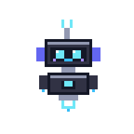

<div align="center">



# ⚡ Sudarshan Sunil Hadmode 

<a href="https://sudarshan.dev/">
  
</a>

<p align="center">
  <a href="https://sudarshan.dev/"></a>
  <a href="https://sudarshan.dev/"></a>
  <a href="https://team-alum.vercel.app"></a>
  <a href="https://team-alum.vercel.app"></a>
  <a href="https://github.com/sudarshandev-llm"></a>
  <a href="https://instagram.com/sudarshan.css"></a>
</p>

<p align="center">
  <a href="#-about-me">About Me</a> •
  <a href="#-featured-work--team-alum">Featured Work</a> •
  <a href="#-interactive-portfolio-features">Interactive FX</a> •
  <a href="#-technical-skills">Skills &amp; Tech</a> •
  <a href="#-getting-started-locally">Run Locally</a> •
  <a href="#-connect">Connect</a>
</p>

---

</div>

## 👨‍💻 About Me

I am a 17-year-old **AI Engineer**, **Prompt Engineer**, and **Full-Stack Developer** based in Pune, India. As the **Startup & Founder** and Lead Architect of [**Team Alum**](https://team-alum.vercel.app) and creator of **Alumni AI** (an advanced AI with many modes and an integrated browser powered by Chrome), I engineer intelligent tools, next-generation AI platforms, and reactive digital experiences with zero bloat.

> *"Seeking information and executing plans after thinking and researching is the quality of my success."*

---

## 🚀 Featured Work & Team Alum

<div align="center">
<table>
  <tr>
    <td width="50%">
      <h3>🌐 <a href="https://team-alum.vercel.app">Team Alum</a></h3>
      <p><b>Startup &amp; Founder &amp; Lead Architect</b></p>
      <p>Official ecosystem delivering intelligent tools, study platforms, and AI applications for students. Engineered with pure modern web standards, Supabase, and verified RLS security.</p>
      <sub><code>AI Engineering</code> • <code>Vanilla JS</code> • <code>Supabase</code> • <code>Vercel</code></sub><br /><br />
      <a href="https://team-alum.vercel.app"><b>Visit team-alum.vercel.app ↗</b></a>
    </td>
    <td width="50%">
      <h3>🤖 <a href="https://app-7r4li86z9ibl.appmedo.com">Alumni AI Beta</a></h3>
      <p><b>AI with Many Modes &amp; Integrated Chrome Browser</b></p>
      <p>An AI with many modes and an integrated browser powered by Chrome, delivering versatile intelligence and real-time web capabilities.</p>
      <sub><code>Alumni AI</code> • <code>Browser (Chrome)</code> • <code>AI Systems</code></sub><br /><br />
      <a href="https://app-7r4li86z9ibl.appmedo.com"><b>Launch App ↗</b></a>
    </td>
  </tr>
  <tr>
    <td width="50%">
      <h3>📚 <a href="https://teamalum-bookstore.vercel.app/">Prompt Engineering Blueprint</a></h3>
      <p><b>Technical Publication &amp; Bookstore</b></p>
      <p>Comprehensive guide and bookstore covering modern prompt engineering practices and real-world LLM workflows.</p>
      <sub><code>Publishing</code> • <code>AI Education</code> • <code>E-Commerce</code></sub><br /><br />
      <a href="https://teamalum-bookstore.vercel.app/"><b>Open Bookstore ↗</b></a>
    </td>
    <td width="50%">
      <h3>🎯 <a href="https://app-c0l89hyi92pt.appmedo.com">Nexora Platform</a></h3>
      <p><b>Student Productivity Suite</b></p>
      <p>Digital platform built around student productivity, organizational routines, and academic management.</p>
      <sub><code>Web App</code> • <code>Productivity</code> • <code>Automation</code></sub><br /><br />
      <a href="https://app-c0l89hyi92pt.appmedo.com"><b>Explore Nexora ↗</b></a>
    </td>
  </tr>
</table>
</div>

---

## 🌟 Interactive Portfolio Features

This portfolio is an experimental, high-performance web experience crafted with **zero external CSS/JS frameworks**:

- **🤖 Interactive Robot Companion**: Animated SVG robot assistant that tracks interactions, provides context, and greets visitors.
- **🔊 Web Audio API Synthesizer**: Native in-browser audio engine generating custom frequency-modulated clicks, hover chirps, and sound feedback without static audio files.
- **✨ Ambient Canvas & Fluid Orbs**: Floating multi-layered particle system and radial gradient blurs rendering across the viewport with GPU acceleration.
- **🎯 Dynamic Cursor & Physics**: Custom cursor dot and trailing focus ring with `mix-blend-mode: screen`.
- **🌈 Edge FX Engine**: Dynamic peripheral ambient glow highlighting viewport borders during user scroll.
- **📱 Fully Responsive**: Fluid typography, touch-optimized layouts, and smooth animations across desktop, tablet, and mobile devices.

---

## 🛠️ Technical Skills

| Domain | Technologies &amp; Capabilities |
| :--- | :--- |
| **Artificial Intelligence** | Prompt Engineering, Context Architecture, Multi-Mode Reasoning, Tool Calling, Autonomous Pipelines, LLM Integrations |
| **Frontend Development** | Semantic HTML5, CSS3 (Glassmorphism, Claymorphism, Keyframes), Vanilla JavaScript (ES6+), Canvas API, Web Audio API |
| **Backend &amp; Cloud** | Supabase, PostgreSQL, Row Level Security (RLS), RESTful APIs, Vercel Edge Hosting |
| **Design &amp; UI/UX** | User-Centered Design, Fluid Micro-Interactions, Motion Design, Design Systems, Typography (`Syne`, `DM Sans`) |

---

## 📁 Repository Structure

```bash
sudarshan-portfolio/
├── index.html                      # Complete interactive portfolio (HTML5, CSS3, Vanilla JS, Canvas, Audio)
├── README.md                       # Professional repository documentation
├── assets/
│   └── pixel-companion.gif         # Pixel art animated companion
├── robots.txt                      # Search engine & AI crawler manifest
├── sitemap.xml                     # XML sitemap for Google & Bing
├── llms.txt                        # Standard manifest for AI search & LLMs
└── googlee30616999c39952b.html     # Google Search Console domain verification
```

---

## ⚡ Getting Started Locally

This portfolio has **zero dependencies** and requires no build steps or package managers.

```bash
# 1. Clone the repository
git clone https://github.com/SudarshanBBS/sudarshan-portfolio.git
cd sudarshan-portfolio

# 2. Run a local server
python -m http.server 8000
# or
npx serve .

# 3. Open in your browser
# Navigate to http://localhost:8000
```

---

## 📬 Connect & Inquiries

- **Official Portfolio**: [sudarshan.dev](https://sudarshan.dev/)
- **Team Alum Platform**: [team-alum.vercel.app](https://team-alum.vercel.app)
- **Email**: [sudarshan.deve@gmail.com](mailto:sudarshan.deve@gmail.com)
- **Instagram**: [@sudarshan.css](https://instagram.com/sudarshan.css)
- **LinkedIn**: [Sudarshan Hadmode](https://linkedin.com/in/sudarshan-hadmode)
- **GitHub**: [@sudarshandev-llm](https://github.com/sudarshandev-llm)

---

<div align="center">
  <sub>© 2026 Sudarshan Sunil Hadmode • Startup &amp; Founder of <a href="https://team-alum.vercel.app">Team Alum</a>, Sudarshan &amp; Soham • Crafted with passion from Pune, India 🇮🇳</sub>
</div>
